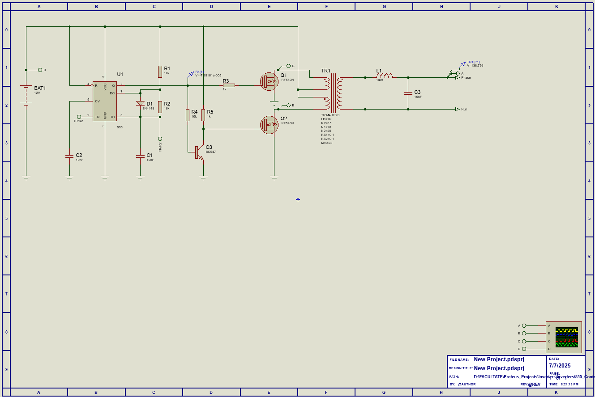
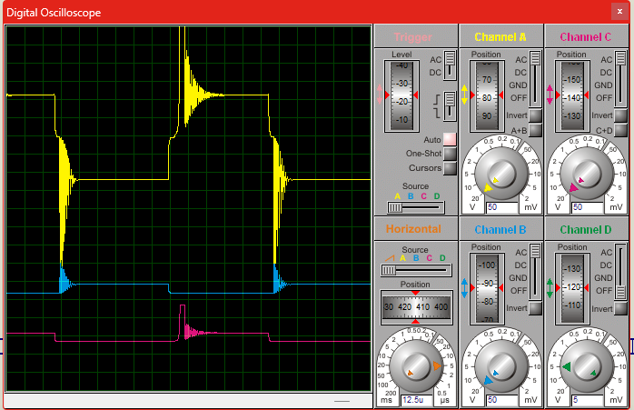
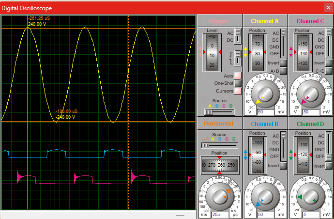
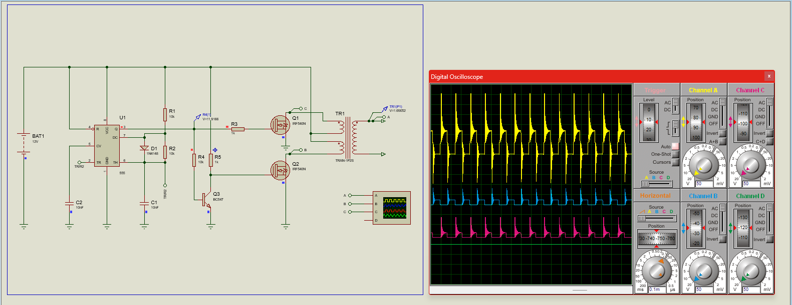
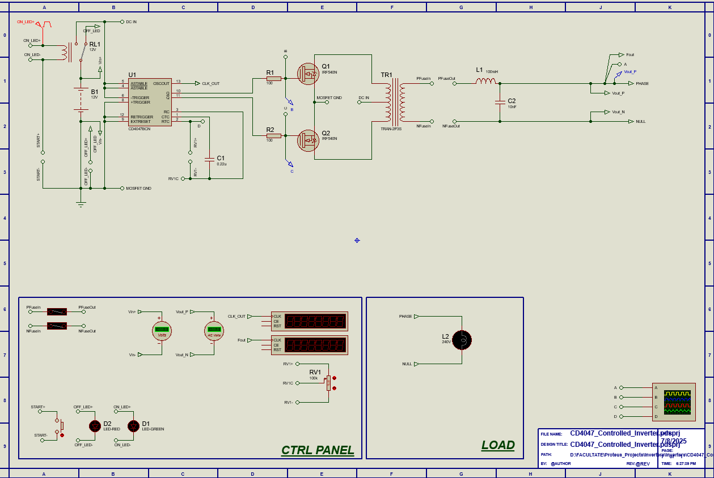
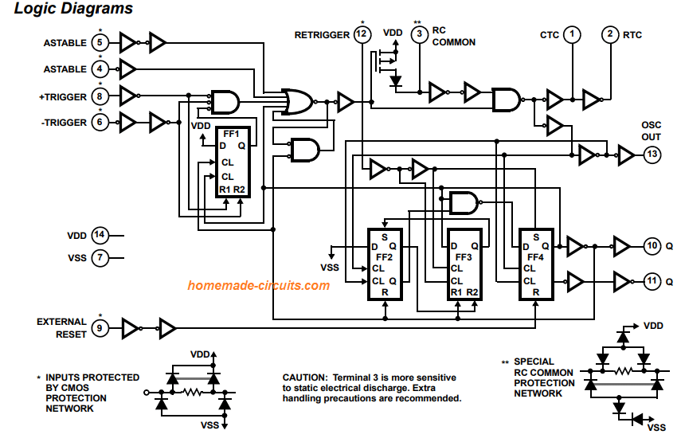
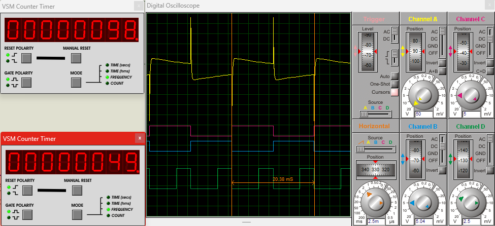
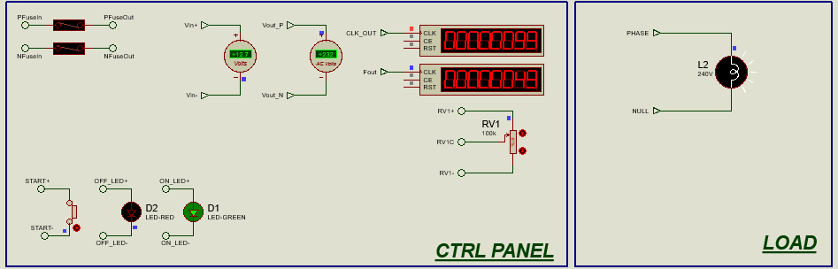
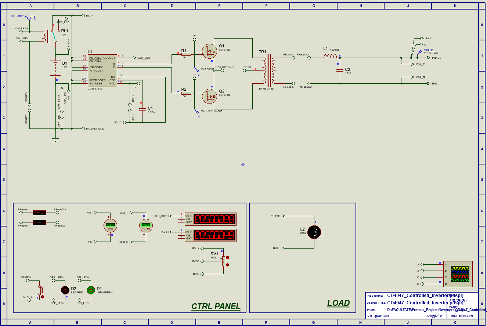

# Inverters
# 🌀 Simulated Inverters in Proteus Controlled by Different Logic Circuits

This project showcases the simulation of two types of inverters in Proteus, each controlled by a different circuit: a 555 timer and a CD4047 multivibrator. The goal is to generate an AC-like signal from a 12V DC source using MOSFET switching and LC filtering.

## 🔗 Quick Navigation

1. [Inverter controlled by 555 Timer](#1-555-controlled-inverter)
2. [Inverter controlled by CD4047](#2-cd4047-controlled-inverter)

---

## 1. ⚡ 555 Controlled Inverter

### 📸 Overview Image

🔗 [Bitmap](555_Controlled_Inverter/img/Schematic_Layout_555_Inverter_LC_Filter.bmp)

### 🔍 General Description
- **Input:** 12V DC  
- **Output (estimated):** 240V AC via transformer step-up

### 🧠 555 Timer Circuit
- The 555 timer operates in **astable mode** to generate a square wave signal.
- This signal controls the switching of MOSFETs for transformer drive.

📸 Internal block diagram:  

### 🔌 Transformer
- Type: `TRAN 1P2S`
- **Primary inductance:** 1H  
- **Turns ratio:** 1:20

### ⚙️ Switching
- Performed using **IRF540N MOSFETs** in a push-pull configuration connected to the transformer’s primary coil.

### 🎛️ LC Filter
- **Inductance (L):** 1mH  
- **Capacitance (C):** 10nF  
- **Cut-off frequency:**
  \[
  f_c = \frac{1}{2\pi\sqrt{LC}} \approx 50.3\,kHz
  \]

### 📉 Output waveform – Before filtering
- A square wave signal at the transformer secondary.  
  
🔗 [View waveform as PDF](555_Controlled_Inverter/img/Scope_View.pdf)

### 📈 Output waveform – After filtering
- A filtered waveform, sinusoidal.  
  
🔗 [View waveform as PDF](555_Controlled_Inverter/img/Scope_View_LC_FIlter_Output.pdf)

### 🧪 Simulations
- 📸 Unfiltered signal:  
  
- 📸 Filtered signal:  
  

---

## 2. ⚡ CD4047 Controlled Inverter

### 📸 Overview Image

### 🔍 General Description
- **Input:** 12V DC  
- **Output (estimated):** 240V AC via transformer

### 🧠 CD4047 Circuit
- The CD4047 works in **astable mode**, generating complementary outputs Q and Q̅ to drive the MOSFETs.

📸 Internal block diagram:  

### 🔌 Transformer
- Type: `TRAN 2P3S`
- **Primary inductance:** 1H  
- **Secondary inductance:** 5mH  
- **Coupling factor:** 1.0

### ⚙️ Switching
- Driven by **IRF540N MOSFETs** controlled directly from the CD4047’s Q/Q̅ outputs.

### 🎛️ LC Filter
- **Inductance (L):** 1mH  
- **Capacitance (C):** 10nF  
- **Cut-off frequency:**
  \[
  f_c = \frac{1}{2\pi\sqrt{LC}} \approx 50.3\,kHz
  \]

### 📉 Filtered Output Waveform
- The signal remains **pulsed and sharp** even after filtering.

📸 Simulation:  

🔗 [View waveform as PDF](CD4047_Controlled_Inverter/img/Waveform.pdf)

#### ⚠️ Note:
Due to the pulse nature of the output signal, the LC filter cannot reconstruct a clean sinusoidal waveform. The signal lacks sufficient harmonic content in the fundamental frequency range.

---

## 🕹️ Control Interface

### ✅ Control Logic:
- Relay-based power control using a **pulse signal:**
  - **Amplitude:** 12V
  - **Delay:** 10µs
  - **Duty cycle:** 100%
  - **Frequency:** 1Hz

### 🔦 Indicators and Monitoring:
- **ON/OFF Status LEDs:**
  - Green: System ON
  - Red: System OFF

- **Measurement:**
  - Digital voltmeters for DC input and AC output
  - LCD display for control frequency and output frequency

- **Adjustability:**
  - Frequency and PWM regulation via **RV1 (variable resistor)**
  - Output protected via **fuses**

📸 Control Panel:  

---

## 💡 Load

The output load is simulated using an incandescent **lamp rated at 240V AC**.

📸 Load Simulation:  

---

